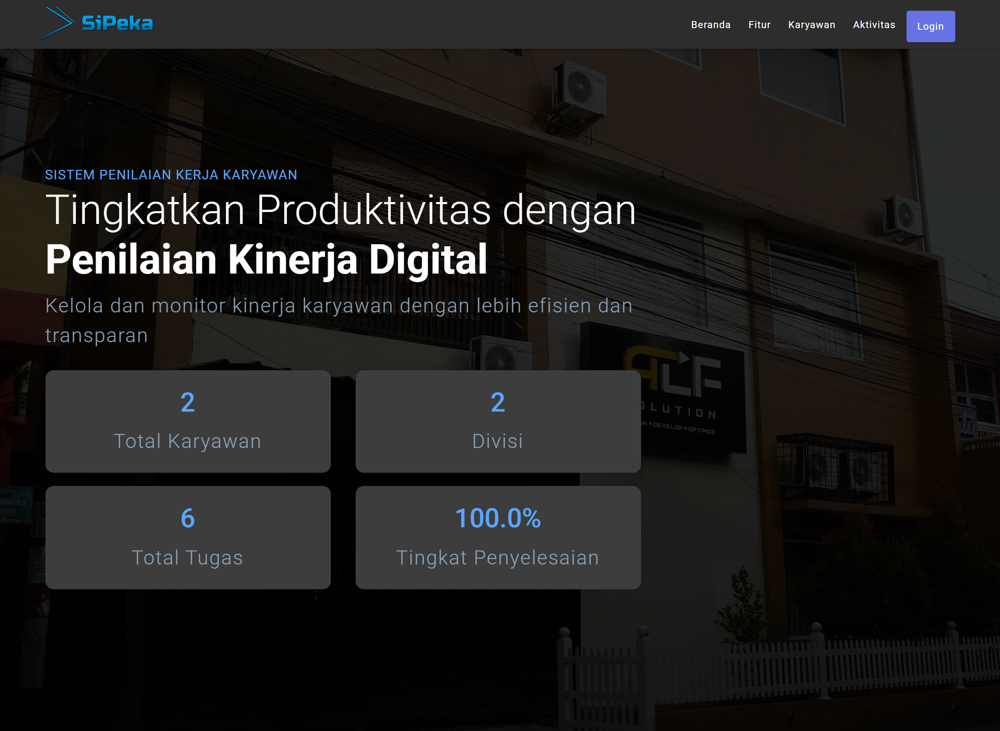
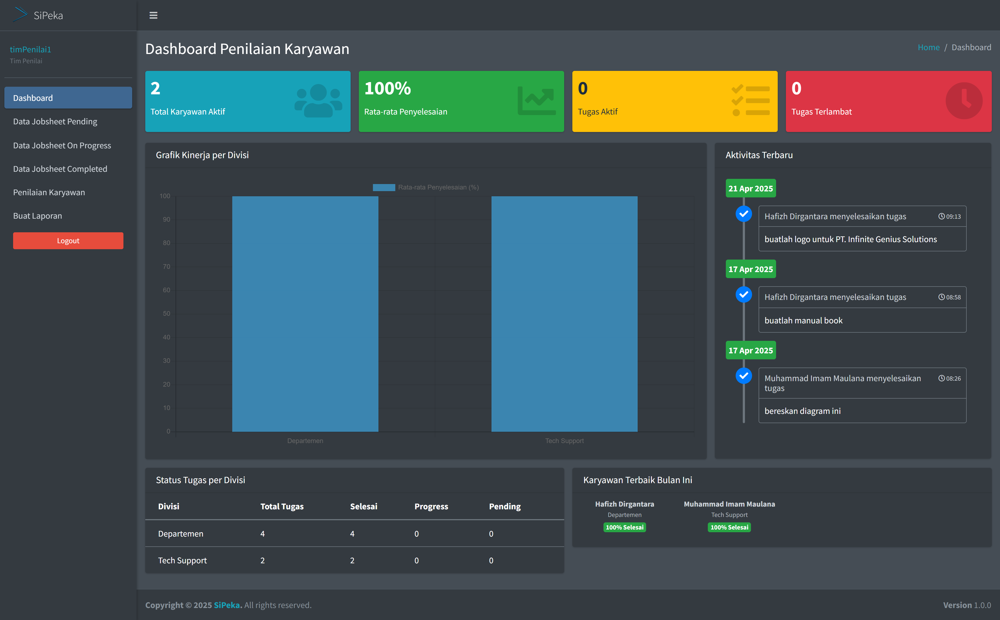
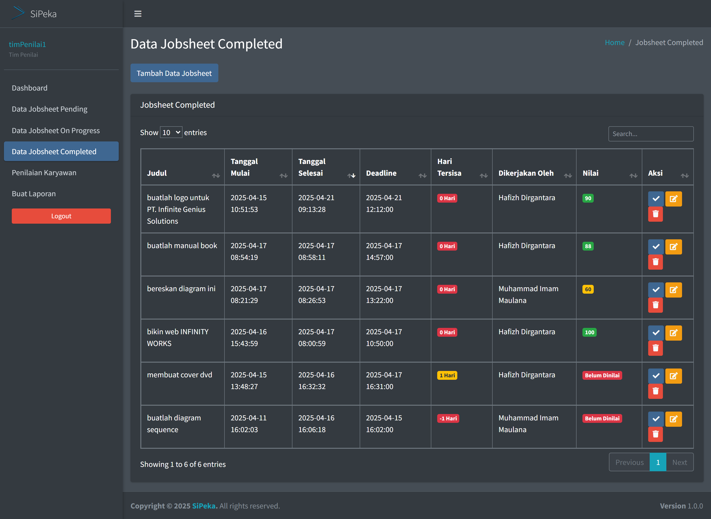
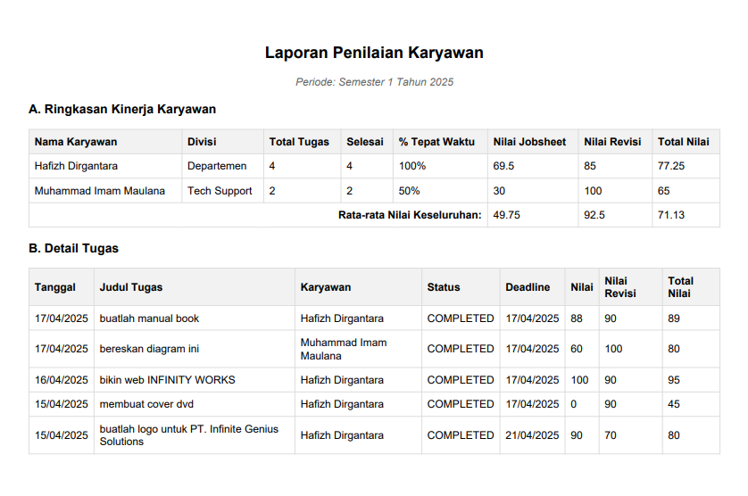

# SiPeka - Employee Performance Assessment System


A web-based employee performance assessment system built with CodeIgniter 3. This application allows managers to assign, track and evaluate employee tasks/jobsheets while providing employees visibility into their performance metrics.

## Features

### Role-Based Access Control

- **Tim Penilai (Assessor Team)**: Can assign tasks, review submissions, provide scores and request revisions
- **Karyawan (Employee)**: Can view assigned tasks, submit completed work, and track performance
- **KepSek (Principal)**: Can view overall performance reports
- **Admin**: System administration

### Task Management

- Create and assign jobsheets to employees with deadlines
- Upload reference files for tasks (max 5 files)
- Track task status (Pending, On Progress, Completed)
- Submit completed work with attachments
- Request task revisions with feedback

### Performance Evaluation

- Score completed tasks
- Track revision scores (deducts 10 points per revision)
- Calculate performance metrics:
  - Task completion rate
  - On-time submission rate
  - Average task scores
  - Average revision scores

### Reporting

- Generate periodic performance reports (monthly/semester/yearly)
- Filter reports by division
- Export reports as PDF
- Track employee performance trends

## Screenshots

### Placeholder Landing Page


*Replaceable landing page, showcasing the system's features*

### Dashboard & Navigation


*Main dashboard showing performance metrics and quick actions*

### Task Managements


*Task management interface for assessors*

### Performance Reports


*Sample employee performance report with metrics*

## Technical Details

### Built With

- CodeIgniter 3
- MySQL Database
- Bootstrap Admin LTE Theme
- SweetAlert2 for notifications

### Key Features

```php
// Task Status Flow
status = enum('PENDING','ON PROGRESS','COMPLETED')

// File Upload Restrictions
maxFiles = 5
maxSize = 32MB 
allowedTypes = [
  'pdf', 'doc', 'docx', 'xls', 'xlsx',
  'jpg', 'jpeg', 'png', 'zip', 'rar'
]
```

## Getting Started

1. Clone the repository
2. Import `db_penilaian_karyawan.sql` to create the database
3. Configure database credentials in `application/config/database.php`
4. Configure base URL in `application/config/config.php`
5. Access the application through web browser

## Directory Structure

```dir
PenilaianKaryawan/
├── application/
│   ├── controllers/
│   │   ├── C_Penilai.php     # Assessor controller
│   │   └── C_Karyawan.php    # Employee controller
│   ├── models/
│   │   ├── Penilai_model.php
│   │   └── Karyawan_model.php
│   └── views/
│       ├── penilai/          # Assessor views
│       └── karyawan/         # Employee views
├── uploads/
│   └── jobsheet/            # Task attachments directory
└── db_penilaian_karyawan.sql
```

## License

Released under the MIT License. See `LICENSE` for more information.

## Author

[Razanius12](https://github.com/Razanius12) - Built for [IGASAR PINDAD](https://g.co/kgs/HGfKxKk) Vocational Competency Test 2025

## Credits

- [CodeIgniter 3](https://codeigniter.com/)
- [Bootstrap Admin LTE](https://adminlte.io/)
- [The Seo Company](https://github.com/technext/the-seo-company)
